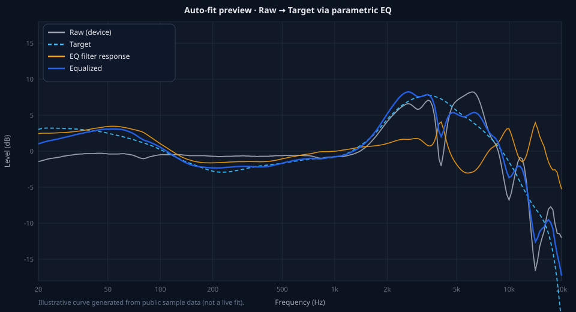

# PEQ-WebUI

[简体中文](README.md) · [English](README.en.md)

Windows 上面向 **[Equalizer APO](https://sourceforge.net/projects/equalizerapo/)** 的浏览器参数 EQ 控制台。

在网页里编辑多段 PEQ、管理预设、一键激活；Equalizer APO 会实时把配置作用到系统音频。

## 功能

- **可视化 PEQ 编辑** — 频响曲线、拖点改频率/增益/Q
- **预设管理** — 新建、重命名、排序、激活或直通（`pure`）
- **自动拟合**（核心）— 把设备原始频响对齐到目标曲线，自动生成多段 PK/LS/HS
- **曲线库** — 示例设备/目标曲线，支持 CSV 与 AutoEq 导入
- **可选 AutoEq 检索** — 从本地 [AutoEq](https://github.com/jaakkopasanen/AutoEq) 库搜索耳机并导入测量/PEQ
- **纯本地** — 仅监听 `127.0.0.1:9100`，无需账号、不上传云端

## 自动拟合（核心能力）

自动拟合要做的事可以概括成一句话：

> **给定耳机的原始频响（Raw）和一条目标曲线（Target），自动求出一组参数 EQ，让「Raw + EQ」尽量贴合 Target。**



上图为示意图（用仓库内公开示例曲线生成，非实时计算结果）：

| 曲线 | 含义 |
|---|---|
| 灰实线 **Raw** | 耳机原始测量频响 |
| 蓝虚线 **Target** | 目标曲线（如 Harman 头戴 2018） |
| 橙实线 **EQ** | 拟合得到的滤波器总响应 |
| 蓝粗线 **Equalized** | Raw 叠加 EQ 后的预测结果 |

### 流程

1. **曲线对齐** — 参考频段（默认约 500 Hz–2 kHz）均值平移到 0 dB，避免整条曲线整体偏高/偏低导致无谓 EQ  
2. **误差场** — 在对数频轴上采样 `Target − Raw`，作为“还差多少 dB”  
3. **布点与优化** — 在误差大的频段布置 Peaking（可选 Low/High Shelf），迭代优化 F / Gain / Q  
4. **Preamp** — 根据最大正增益给出负 preamp，降低削波风险  
5. **写回 APO** — 保存为 `Filter: ON PK Fc … Gain … Q …` 文本；激活时原子写入 `hl-active.txt`

### 两套引擎

| 引擎 | 依赖 | 特点 |
|---|---|---|
| **快速** | 仅 `numpy` | 低频锚点 + 峰值贪心布点 + 坐标下降精修，日常足够快 |
| **精确** | `scipy` + 本地 AutoEq `autoeq` 包 | 桥接 AutoEq 的 SLSQP 联合优化，追求更低 RMS；缺依赖时自动回退快速引擎 |

### 常用参数（前端「自动拟合」页）

- 滤波器数量上限  
- 频带范围（`fmin` / `fmax`）  
- 最大增益 / 最大 Q  
- 跨测量 rig 保护：设备与目标来自不同人工耳体系时，高频可能把 `fmax` 收敛到约 7 kHz 并给出警告（可用 `allow_cross_rig_hf` 强制）

### 典型用法

1. 选择设备曲线（或从 AutoEq 导入 raw）  
2. 选择目标曲线（Harman / 扩散场 / 平直 / 自定义 CSV）  
3. 打开「自动拟合」或点击「拟合预览」  
4. 在图上检查 Equalized 是否贴近 Target，必要时手调个别频点  
5. 「采用为草稿」→「保存到预设」→ 双击预设激活试听  

详见 [用户操作手册.md](用户操作手册.md)。

## 快速开始

**环境：** Windows 10/11，已安装 [Equalizer APO](https://sourceforge.net/projects/equalizerapo/)，Python 3.10+，`numpy`（可选 `scipy` 用于精确拟合）。

```powershell
cd PEQ-WebUI
py -m pip install numpy
.\start-webui.ps1
```

浏览器打开 **http://127.0.0.1:9100**

也可双击 `启动PEQ-WebUI.cmd`。

### 首次接管 APO（仅一次）

Equalizer APO 默认读取 `C:\Program Files\EqualizerAPO\config`（普通权限常写不进）。本项目会把配置迁到项目内目录，并把注册表 `ConfigPath` 指过去——**需要一次管理员操作**，之后日常使用无需提权。

细节见 [部署手册.md](部署手册.md)（安装坑 / 回滚）与 [用户操作手册.md](用户操作手册.md)（日常操作）。

```powershell
# 管理员 PowerShell，在项目根目录执行
py -c "from apo_backend import ApoBackend; a=ApoBackend(); a.set_auto_install_enabled(True); print(a.install(by='admin'))"
```

### 可选 AutoEq 数据库

默认路径（可用环境变量 `AUTOEQ_ROOT` 覆盖）：

```text
<仓库>/../AutoEq-4.1.2/AutoEq-4.1.2
```

请自行获取 AutoEq 完整库；体积较大，**不**随本仓库分发。

## 文档

| 文档 | 语言 | 内容 |
|---|---|---|
| [README.md](README.md) | 中文 | 本页（默认） |
| [README.en.md](README.en.md) | EN | English overview |
| [部署手册.md](部署手册.md) | 中文 | APO 安装 / 权限 / 接管 / 回滚 |
| [用户操作手册.md](用户操作手册.md) | 中文 | 日常操作 |
| [开发维护文档.md](开发维护文档.md) | 中文 | 模块与 API |
| [webui操作手册.html](webui操作手册.html) | 中文 | HTML 手册 |
| [ACKNOWLEDGMENTS.md](ACKNOWLEDGMENTS.md) | EN | 致谢 |
| [NOTICE.md](NOTICE.md) | EN | 第三方许可与数据来源 |
| [LICENSE](LICENSE) | — | MIT |

## 致谢

本项目站在许多优秀开源与测量工作的肩膀上：

- **[AutoEq](https://github.com/jaakkopasanen/AutoEq)** — 测量库组织、目标曲线约定与精确 PEQ 优化思路（MIT）；自动拟合的参数语义与数据组织大量借鉴该项目
- **[Equalizer APO](https://sourceforge.net/projects/equalizerapo/)** — 本 UI 所配置的系统音频引擎
- 测量社区：oratory1990、crinacle、Rtings、InnerFidelity、Super\* Review / squig.link、Kuulokenurkka、Auriculares Argentina 等（经由 AutoEq 公开数据集）
- Harman 研究目标曲线（经 AutoEq 生态再分发；**非**官方背书）

完整署名与法律说明：[ACKNOWLEDGMENTS.md](ACKNOWLEDGMENTS.md) · [NOTICE.md](NOTICE.md)。

与 Equalizer APO、AutoEq、Harman、Rtings、crinacle、oratory1990 等**无官方关联**。

## 许可

代码：[MIT](LICENSE)。第三方软件与测量数据版权归各自权利人，详见 [NOTICE.md](NOTICE.md)。
